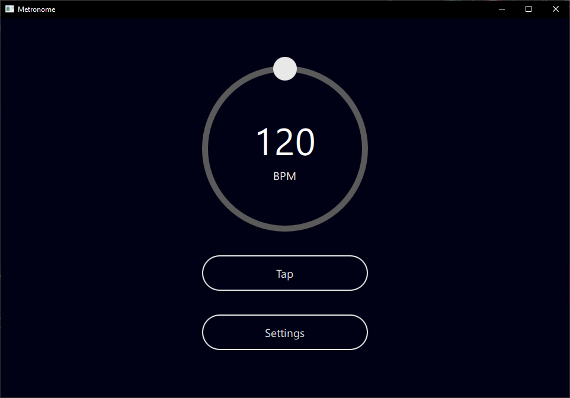

:construction: **Metronome is still a WIP with missing features and various bugs**

# Metronome

A simple, yet featureful metronome app for desktop



## How to Run

<!-- TODO: Write proper instructions -->

```bash
cd src
# On Linux and macOS
python3 .
# On Windows
python .
```

## Running tests

```bash
fd "tests.py" -x pytest
```

## Thirdparty

Thanks to these projects for making Metronome possible. :)

- PySide6
- PyTest
- [PyDispatcher](https://github.com/mcfletch/pydispatcher)

## License

Metronome is licensed under the GNU General Public License (GPL) version 3.
